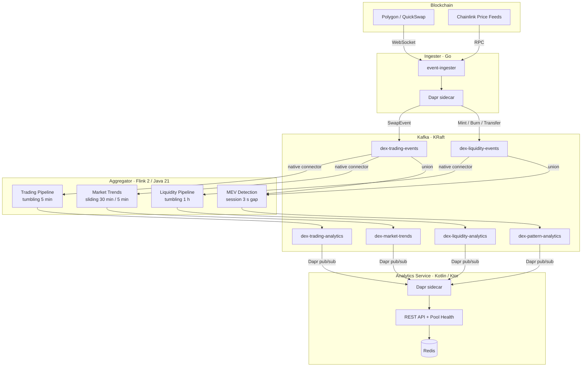
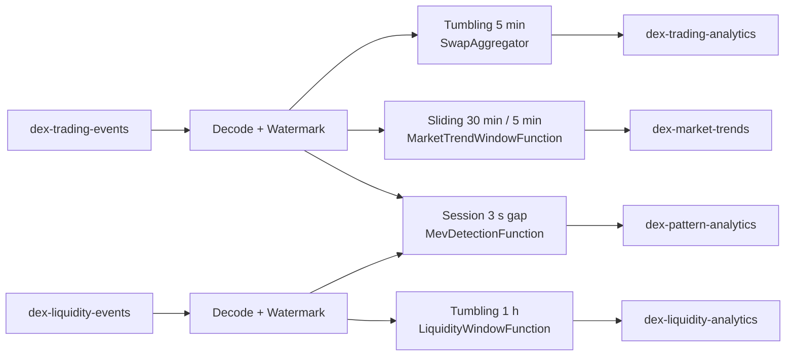

# Architecture

Technical architecture for the DEX Stream Analytics pipeline.

## System Overview

## Event-to-Analytics Mapping

| Input Topic | Event Types | Output Topic | Window | Purpose |
|---|---|---|---|---|
| `dex-trading-events` | SwapEvent | `dex-trading-analytics` | 5-min tumbling | TWAP, OHLC, volume, trader activity |
| `dex-liquidity-events` | Mint + Burn + Transfer | `dex-liquidity-analytics` | 1-hour tumbling | LP flows, TVL changes, churn rate |
| Both topics | All events | `dex-pattern-analytics` | Session (3 s gap) | Sandwich attacks, JIT liquidity |
| `dex-trading-events` | SwapEvent | `dex-market-trends` | 30-min sliding / 5-min slide | Price momentum, volatility, trend direction |

Swap events produce **trading** analytics; Mint/Burn events produce **liquidity** analytics. MEV detection requires cross-event correlation across both topics.

## Design Decisions

### Dual-Topic Input

Events are separated by frequency into `dex-trading-events` (~100/min) and `dex-liquidity-events` (~10/min). This allows independent consumer scaling, retention policies (7 vs 30 days), and prevents high-frequency swap noise from delaying liquidity consumers.

The liquidity topic carries multiple schemas (Mint, Burn, Transfer). The aggregator resolves the correct Avro schema via the CloudEvent `type` header before decode — no shape-guessing.

### Flink Native Kafka (Not Dapr)

The aggregator uses Flink's native Kafka connector for exactly-once semantics (two-phase commit), checkpoint integration, event-time watermarks, and backpressure. Dapr's at-least-once HTTP model cannot provide these guarantees.

Dapr **is** used where its strengths apply: the ingester (decouple from Kafka) and the analytics service (simple subscription model).

### Chainlink Price Oracle

USD volume is computed in the ingester using Chainlink on-chain price feeds with a four-tier fallback: stablecoin shortcut → Chainlink token0 → Chainlink token1 → swap-implied price. Prices are cached with 5-minute TTL; stablecoin lookups are zero-cost.

### Finality Gate

The ingester buffers events for N block confirmations (default 64) before publishing. This prevents reorg artifacts from entering the analytics pipeline at the cost of a small latency increase.

## Component Overview

### event-ingester (Go)

WebSocket subscription to a Uniswap V2 pair contract on Polygon. Enriches raw logs with block timestamps, gas data, token symbols, and Chainlink USD prices. Encodes to Avro and publishes via Dapr. Two goroutines: one listens, one publishes through a buffered channel.

### stream-aggregator (Flink / Java 21)

Four parallel pipelines reading from two input topics. Events are decoded and watermarked once per source, then fanned out:

Fault tolerance: 60 s bounded-out-of-orderness watermarks, fixed-delay restart (3 attempts / 10 s), exactly-once delivery via Kafka transactions.

### analytics-service (Kotlin / Ktor)

Subscribes to all four output topics via Dapr push. Stores data in Redis sorted sets (scored by `windowStart` or `detectedAt`). Computes a composite **Pool Health Score** (35 % trading + 35 % liquidity + 30 % safety) and serves query endpoints:

| Group | Endpoints |
|---|---|
| Trading | `/pairs/{pair}/twap`, `/ohlc`, `/volume`, `/trading`, `/latest` |
| Liquidity | `/pairs/{pair}/liquidity`, `/liquidity/latest`, `/liquidity/flows` |
| Pool Health | `/pools/{pair}/health`, `/pools/{pair}/alerts`, `/pools/{pair}/trends`, `/pools/leaderboard` |
| Meta | `/analytics/summary`, `/analytics/pairs`, `/health` |
| Dashboard | `/dashboard` (HTML), `/ws/analytics` (WebSocket live stream) |

## Infrastructure

### Kafka Topics

| Topic | Schema(s) | Partitions | Retention |
|---|---|---|---|
| `dex-trading-events` | SwapEvent | 6 | 7 d |
| `dex-liquidity-events` | Mint / Burn / Transfer | 6 | 30 d |
| `dex-trading-analytics` | AggregatedAnalytics | 3 | 30 d |
| `dex-liquidity-analytics` | LiquidityAnalytics | 3 | 90 d |
| `dex-pattern-analytics` | MevAlert | 3 | 30 d |
| `dex-market-trends` | MarketTrend | 3 | 30 d |

Input topics are keyed by `pairAddress`; output topics by `windowId`.

### Docker Compose Services

| Service | Purpose | Port |
|---|---|---|
| kafka | KRaft broker | 9092 |
| redis | Analytics store | 6379 |
| dapr-placement | Dapr placement | 6050 |
| ingester + sidecar | Go blockchain listener | — |
| aggregator | Flink job | 8081 (Web UI) |
| analytics-service + sidecar | Kotlin API | 8080 |

## Future Work

- **Multi-pool support**: dynamic pool discovery via Factory contract `PairCreated` events.
- **Durable checkpointing**: S3/GCS checkpoint backend + RocksDB state for large windows.
- **Observability**: Prometheus metrics, Grafana dashboards, structured logging with correlation IDs.
- **Production hardening**: Kafka SASL/TLS, Dapr mTLS, secrets management, JWT auth + rate limiting.
