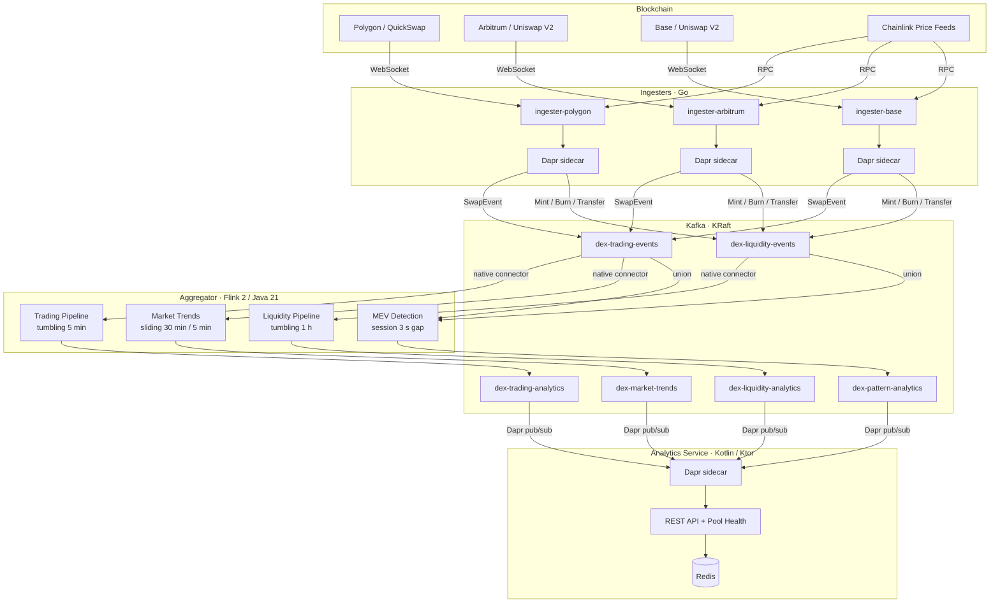
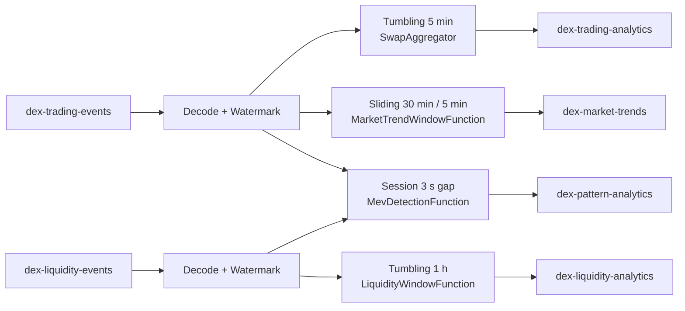

# Architecture

Technical architecture for the DEX Stream Analytics pipeline.

## System Overview

```mermaid
graph TD
    subgraph Blockchain
        POLY[Polygon / QuickSwap]
        ARB[Arbitrum / Uniswap V2]
        BASE[Base / Uniswap V2]
        CHAIN[Chainlink Price Feeds]
    end

    subgraph "Ingesters · Go"
        ING_P[ingester-polygon]
        ING_A[ingester-arbitrum]
        ING_B[ingester-base]
        DAPR_P[Dapr sidecar]
        DAPR_A[Dapr sidecar]
        DAPR_B[Dapr sidecar]
    end

    subgraph "Kafka · KRaft"
        KT[dex-trading-events]
        KL[dex-liquidity-events]
        OT[dex-trading-analytics]
        OL[dex-liquidity-analytics]
        OP[dex-pattern-analytics]
        OM[dex-market-trends]
    end

    subgraph "Aggregator · Flink 2 / Java 21"
        F1[Trading Pipeline<br/>tumbling 5 min]
        F2[Liquidity Pipeline<br/>tumbling 1 h]
        F3[MEV Detection<br/>session 3 s gap]
        F4[Market Trends<br/>sliding 30 min / 5 min]
    end

    subgraph "Analytics Service · Kotlin / Ktor"
        API[REST API + Pool Health]
        API_DAPR[Dapr sidecar]
        REDIS[(Redis)]
    end

    POLY -- WebSocket --> ING_P
    ARB -- WebSocket --> ING_A
    BASE -- WebSocket --> ING_B
    CHAIN -- RPC --> ING_P & ING_A & ING_B
    
    ING_P --> DAPR_P
    ING_A --> DAPR_A
    ING_B --> DAPR_B
    
    DAPR_P & DAPR_A & DAPR_B -- SwapEvent --> KT
    DAPR_P & DAPR_A & DAPR_B -- "Mint / Burn / Transfer" --> KL

    KT -- native connector --> F1
    KT -- native connector --> F4
    KL -- native connector --> F2
    KT & KL -- union --> F3

    F1 --> OT
    F2 --> OL
    F3 --> OP
    F4 --> OM

    OT & OL & OP & OM -- Dapr pub/sub --> API_DAPR
    API_DAPR --> API
    API --> REDIS
```

## Event-to-Analytics Mapping

| Input Topic | Event Types | Output Topic | Window | Purpose |
|---|---|---|---|---|
| `dex-trading-events` | SwapEvent | `dex-trading-analytics` | 5-min tumbling | TWAP, OHLC, volume, trader activity |
| `dex-liquidity-events` | Mint + Burn + Transfer | `dex-liquidity-analytics` | 1-hour tumbling | LP flows, TVL changes, churn rate |
| Both topics | All events | `dex-pattern-analytics` | Session (3 s gap) | Sandwich attacks, JIT liquidity |
| `dex-trading-events` | SwapEvent | `dex-market-trends` | 30-min sliding / 5-min slide | Price momentum, volatility, trend direction |

Swap events produce **trading** analytics; Mint/Burn events produce **liquidity** analytics. MEV detection requires cross-event correlation across both topics.

## Design Decisions

### Multi-Chain Architecture

Monitors three chains simultaneously: Polygon (L2), Arbitrum (L2), and Base (L2). Each chain runs an independent ingester instance publishing to shared Kafka topics with `chainId` partitioning.

**Why these chains**:
- **Polygon**: High DEX volume, low gas costs, mature DeFi ecosystem
- **Arbitrum**: Largest L2 by TVL, different MEV dynamics than Polygon
- **Base**: Coinbase L2, growing adoption, institutional interest

**Cross-chain insights**:
- Compare MEV attack rates across L2s (hypothesis: sequencer differences affect MEV patterns)
- Gas cost analysis: L2 vs theoretical L1 costs
- Liquidity depth and pool health across chains for same pairs (WETH/USDC)

**Partitioning strategy**: Events keyed by `chainId:pairAddress` enable per-chain Flink parallelism while supporting cross-chain aggregations.

**Why not Ethereum L1**: Mainnet RPC costs prohibitive for continuous monitoring; L2s provide production-scale data at lower cost.

Events are separated by frequency into `dex-trading-events` (~100/min) and `dex-liquidity-events` (~10/min). This allows independent consumer scaling, retention policies (7 vs 30 days), and prevents high-frequency swap noise from delaying liquidity consumers.

The liquidity topic carries multiple schemas (Mint, Burn, Transfer). The aggregator resolves the correct Avro schema via the CloudEvent `type` header before decode — no shape-guessing.

### Flink Native Kafka (Not Dapr)

The aggregator uses Flink's native Kafka connector for exactly-once semantics (two-phase commit), checkpoint integration, event-time watermarks, and backpressure. Dapr's at-least-once HTTP model cannot provide these guarantees.

Dapr **is** used where its strengths apply: the ingester (decouple from Kafka) and the analytics service (simple subscription model).

**Flink choice rationale**: Selected over Kafka Streams for richer windowing (session windows for MEV detection), event-time semantics, and exactly-once guarantees. Leverages patterns from REA's Property Passport event pipeline, adapted for blockchain-specific challenges (finality, reorgs, high-frequency MEV patterns).

### Chainlink Price Oracle

USD volume is computed in the ingester using Chainlink on-chain price feeds with a four-tier fallback: stablecoin shortcut → Chainlink token0 → Chainlink token1 → swap-implied price. Prices are cached with 5-minute TTL; stablecoin lookups are zero-cost.

### Finality Gate

The ingester buffers events for N block confirmations (default 64) before publishing. This prevents reorg artifacts from entering the analytics pipeline at the cost of a small latency increase.

## Component Overview

### event-ingester (Go)

One instance per chain. WebSocket subscription to a Uniswap V2 pair contract. Enriches raw logs with block timestamps, gas data, token symbols, and Chainlink USD prices. Encodes to Avro with `chainId` and `chainName` fields, publishes via Dapr. Two goroutines per instance: one listens, one publishes through a buffered channel.

**Deployment**: Three Docker containers (`ingester-polygon`, `ingester-arbitrum`, `ingester-base`), each with chain-specific RPC URL and pair address. Shared Kafka topics receive events from all chains.

### stream-aggregator (Flink / Java 21)

Four parallel pipelines reading from two input topics. Events from all chains flow through shared topics. Decoded and watermarked once per source, then keyed by `chainId:pairAddress` for per-chain partitioning:

```mermaid
graph LR
    KT[dex-trading-events] --> DECODE_T[Decode + Watermark]
    KL[dex-liquidity-events] --> DECODE_L[Decode + Watermark]

    DECODE_T --> F1[Tumbling 5 min<br/>SwapAggregator]
    DECODE_T --> F4[Sliding 30 min / 5 min<br/>MarketTrendWindowFunction]
    DECODE_L --> F2[Tumbling 1 h<br/>LiquidityWindowFunction]
    DECODE_T & DECODE_L --> F3[Session 3 s gap<br/>MevDetectionFunction]

    F1 --> OT[dex-trading-analytics]
    F2 --> OL[dex-liquidity-analytics]
    F3 --> OP[dex-pattern-analytics]
    F4 --> OM[dex-market-trends]
```

Fault tolerance: 60 s bounded-out-of-orderness watermarks, fixed-delay restart (3 attempts / 10 s), exactly-once delivery via Kafka transactions.

### analytics-service (Kotlin / Ktor)

Subscribes to all four output topics via Dapr push. Stores data in Redis sorted sets (scored by `windowStart` or `detectedAt`). Computes a composite **Pool Health Score** (35 % trading + 35 % liquidity + 30 % safety) and serves query endpoints:

| Group | Endpoints |
|---|---|
| Trading | `/pairs/{pair}/twap`, `/ohlc`, `/volume`, `/trading`, `/latest` |
| Liquidity | `/pairs/{pair}/liquidity`, `/liquidity/latest`, `/liquidity/flows` |
| Pool Health | `/pools/{pair}/health`, `/pools/{pair}/alerts`, `/pools/{pair}/trends`, `/pools/leaderboard` |
| Meta | `/analytics/summary`, `/analytics/pairs`, `/health` |
| Dashboard | `/dashboard` (HTML), `/ws/analytics` (WebSocket live stream) |

## Infrastructure

### Kafka Topics

| Topic | Schema(s) | Partitions | Retention |
|---|---|---|---|
| `dex-trading-events` | SwapEvent | 6 | 7 d |
| `dex-liquidity-events` | Mint / Burn / Transfer | 6 | 30 d |
| `dex-trading-analytics` | AggregatedAnalytics | 3 | 30 d |
| `dex-liquidity-analytics` | LiquidityAnalytics | 3 | 90 d |
| `dex-pattern-analytics` | MevAlert | 3 | 30 d |
| `dex-market-trends` | MarketTrend | 3 | 30 d |

Input topics are keyed by `pairAddress`; output topics by `windowId`.

### Docker Compose Services

| Service | Purpose | Port |
|---|---|---|
| kafka | KRaft broker | 9092 |
| kafka-init | One-shot topic provisioning | — |
| redis | Analytics store | 6379 |
| dapr-placement | Dapr placement | 50006 |
| flink-jobmanager | Builds and runs the Flink job (application mode) | 8081 (Web UI) |
| flink-taskmanager | Flink workers | — |
| analytics-service + sidecar | Kotlin API | 8080 |
| ingester + sidecar (`live` profile) | Go blockchain listener | — |

The default `docker compose up -d` runs the full pipeline without chain access; `scripts/produce_test_events.py` feeds it test events. The `live` profile adds the ingester and requires a Polygon WebSocket RPC endpoint.

## Production vs Prototype

**Simplified for portfolio**:
- Single pair monitoring (WMATIC/USDC) — production needs Factory `PairCreated` event subscription for multi-pool discovery
- In-memory checkpointing — production needs S3/GCS + RocksDB state backend
- No authentication/rate limiting — production needs JWT auth + WAF
- Basic MEV heuristics — production needs gas cost modeling, multi-hop routing analysis

**Production patterns retained**:
- Exactly-once semantics (Flink two-phase commit + Kafka transactions)
- Event-time processing with watermarks (handles out-of-order blockchain events)
- Finality gate (prevents reorg artifacts)
- Polyglot stack with appropriate language choices per component

**Connection to professional experience**: Demonstrates Apache Flink patterns from REA Property Passport NFT pipeline, applied to DeFi challenges (MEV detection, liquidity monitoring, blockchain finality).

## Future Work

- **Multi-pool support**: Dynamic pool discovery via Factory `PairCreated` events
- **Uniswap V3 migration**: Concentrated liquidity, tick-based analytics
- **Advanced MEV detection**: Gas cost modeling, multi-hop routing analysis
- **Cross-chain aggregations**: Unified leaderboards comparing chains
- **Ethereum L1 monitoring**: Mainnet support when RPC costs are feasible
- **Observability**: Prometheus metrics, Grafana dashboards, structured logging
- **Production hardening**: Kafka SASL/TLS, Dapr mTLS, secrets management
