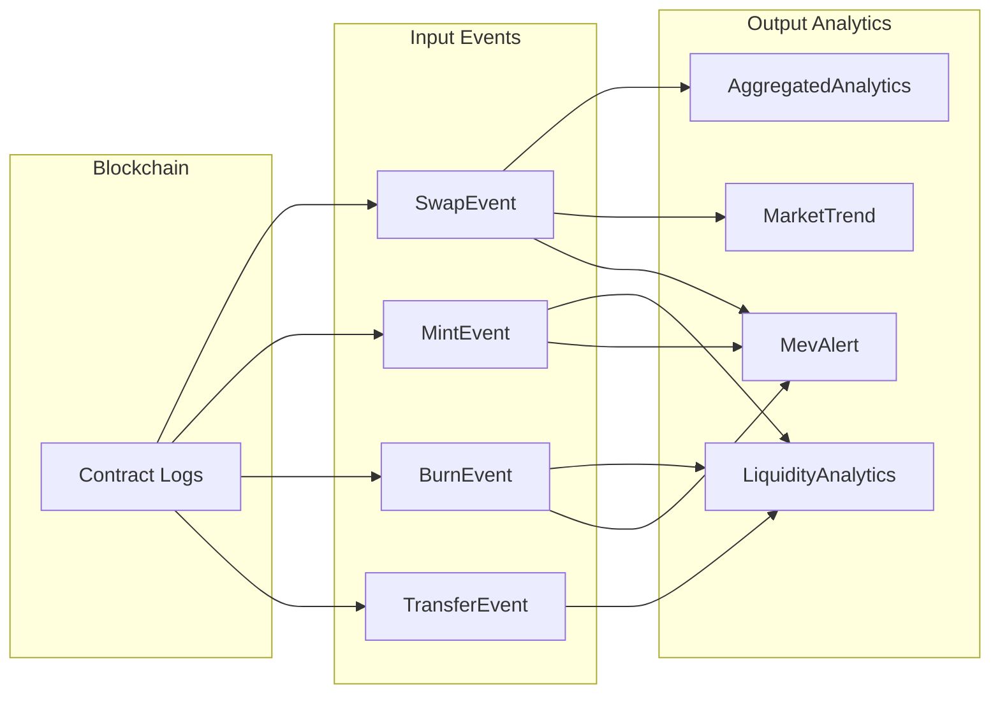

# Data Model

Schema definitions, field semantics, and data flow for the DEX analytics pipeline. Canonical Avro files live in `schemas/avro/`.

## Data Flow

## Blockchain Source

**Contract:** Uniswap V2 Pair (`IUniswapV2Pair`) on Polygon  
**Target Pair:** WMATIC/USDC (`0x6e7a5FAFcec6BB1e78bAE2A1F0B612012BF14827`)

Monitored Solidity events: 
- `Swap(address indexed sender, uint amount0In, uint amount1In, uint amount0Out, uint amount1Out, address indexed to)`
- `Mint(address indexed sender, uint amount0, uint amount1)`
- `Burn(address indexed sender, uint amount0, uint amount1, address indexed to)`.

## Schema Conventions

- **Immutability**: all fields are read-only after creation.
- **Financial precision**: token amounts stored as `string` (Wei) to avoid floating-point loss.
- **Timestamps**: block timestamps in seconds; window and processing timestamps in milliseconds.
- **Identifiers**: `eventId` = `blockNumber-txHash-logIndex` for idempotency; addresses as `0x`-prefixed hex.
- **Optionality**: only truly optional fields use Avro `["null", "type"]` unions.

## Input Event Schemas

### SwapEvent (`dex-trading-events`)

Represents a token trade on the pair.

| Field | Type | Notes |
|---|---|---|
| eventId | string | Deduplication key |
| blockNumber / blockTimestamp | long | Block context (timestamp in seconds) |
| transactionHash / logIndex | string / int | Log location |
| pairAddress | string | Pair contract |
| token0 / token1 | string | Token addresses |
| token0Symbol / token1Symbol | string? | Resolved by ingester (cached) |
| sender / recipient | string | Initiator vs output receiver (differ for router swaps) |
| amount0In / amount1In / amount0Out / amount1Out | string | Wei amounts |
| price | double | Execution price (token1 / token0) |
| volumeUSD | double? | USD volume via Chainlink oracle |
| gasUsed / gasPrice | long / string | Transaction-level gas metrics |
| eventTimestamp | long | Ingester capture time |

### MintEvent (`dex-liquidity-events`)

Liquidity added to the pool.

| Field | Type | Notes |
|---|---|---|
| eventId, blockNumber, blockTimestamp, transactionHash, logIndex | — | Same as SwapEvent |
| pairAddress, token0, token1, token0Symbol?, token1Symbol? | — | Pair context |
| sender | string | Router address (not the actual LP) |
| amount0 / amount1 | string | Tokens added (Wei) |

### BurnEvent (`dex-liquidity-events`)

Liquidity removed from the pool.

| Field | Type | Notes |
|---|---|---|
| (identification + pair fields) | — | Same as MintEvent |
| sender | string | Always the pair contract |
| recipient | string | LP receiving tokens back |
| amount0 / amount1 | string | Tokens removed (Wei) |

### TransferEvent (`dex-liquidity-events`)

LP token movement for correlation with Mint/Burn.

| Field | Type | Notes |
|---|---|---|
| (identification + pair fields) | — | Same pattern |
| from / to | string | LP token sender / receiver |
| value | string | LP tokens moved (Wei) |

## Output Schemas

### AggregatedAnalytics (`dex-trading-analytics`)

5-minute tumbling window over SwapEvents.

| Field | Type | Notes |
|---|---|---|
| windowId | string | `pair:start:end` |
| windowStart / windowEnd | long | Millisecond epoch |
| pairAddress, token0Symbol?, token1Symbol? | — | Pair context |
| twap | double | Volume-weighted average price: $\frac{\sum(price \times volume)}{\sum volume}$ |
| openPrice / closePrice / highPrice / lowPrice | double | OHLC from first, last, max, min swap prices |
| priceVolatility | double | $(high - low) / twap$ |
| totalVolume0 / totalVolume1 | string | Aggregate Wei volumes |
| volumeUSD | double? | Sum of per-swap USD volumes |
| swapCount / uniqueTraders | int | Activity metrics |
| largestSwapValue / largestSwapAddress | string | Whale detection |
| totalGasUsed / averageGasPrice | long / string | Gas metrics |
| arbitrageCount | int | Swaps where sender == recipient |
| repeatedTraders | string[] | Addresses with >1 swap in window |
| processedAt | long | Flink processing time |

### LiquidityAnalytics (`dex-liquidity-analytics`)

1-hour tumbling window over Mint/Burn/Transfer events.

| Field | Type | Notes |
|---|---|---|
| windowId, windowStart, windowEnd, pairAddress | — | Same pattern as above |
| mintCount / burnCount | int | Event counts |
| totalLpTokensMinted / totalLpTokensBurned / netLpTokenChange | string | LP token accounting (Wei) |
| uniqueProviders | int | Distinct LP addresses |
| processedAt | long | Flink processing time |

### MevAlert (`dex-pattern-analytics`)

Session window (3 s gap) detecting MEV patterns across all event types.

| Field | Type | Notes |
|---|---|---|
| alertId | string | UUID |
| alertType | string | `SANDWICH_ATTACK` or `JIT_LIQUIDITY` |
| windowStart / windowEnd | long | Session boundaries |
| pairAddress, token0Symbol?, token1Symbol? | — | Pair context |
| blockNumber | long | Primary block of activity |
| attackerAddress | string? | Detected attacker |
| victimAddresses | string[] | Affected addresses |
| estimatedProfitUSD | double | Estimated attacker profit |
| severity | string | `HIGH` / `MEDIUM` / `LOW` |
| description | string? | Human-readable explanation |
| involvedTransactions | string[] | Transaction hashes |
| detectedAt | long | Detection timestamp |

### MarketTrend (`dex-market-trends`)

30-minute sliding window (5-minute slide) over SwapEvents.

| Field | Type | Notes |
|---|---|---|
| windowId | string | `pair:trend:start:end` |
| windowStart / windowEnd | long | Window boundaries |
| pairAddress, token0Symbol?, token1Symbol? | — | Pair context |
| avgPrice / openPrice / closePrice | double | Price summary |
| priceChangePercent | double | $(close - open) / open \times 100$ |
| volumeUSD | double? | Aggregate volume |
| swapCount / uniqueTraders | int | Activity metrics |
| volatility | double | $(high - low) / twap$ |
| trend | string | `BULLISH` (>1 %), `BEARISH` (<−1 %), `NEUTRAL` |
| processedAt | long | Flink processing time |

### PoolHealth (computed at query time)

Not persisted — computed by the analytics service from stored data.

| Field | Type | Notes |
|---|---|---|
| pairAddress | string | Pool identifier |
| overallScore | double | Weighted composite (0–1) |
| tradingScore | double | 35 % weight — volume, activity, trader diversity |
| liquidityScore | double | 35 % weight — LP event activity |
| safetyScore | double | 30 % weight — inverse of MEV alert count |
| trend | string | Latest market trend direction |
| recentAlertCount | int | MEV alerts in last 24 h |
| volumeUSD24h / uniqueTraders24h | double / int | 24-hour metrics |
| evaluatedAt | long | Computation timestamp |

## Data Quality

- **Reorgs**: 64-block finality gate in ingester; 60 s watermark in Flink absorbs late arrivals.
- **RPC lag**: Paid endpoints recommended; `lastProcessedBlock` should be monitored against chain head.
- **Event ordering**: Guaranteed within a transaction (logIndex); across transactions, event-time windows + watermarks handle out-of-order delivery.
- **Validation**: Ingester validates field presence and address format. Flink validates window boundaries and rejects empty windows.

## Schema Evolution

Avro schemas are versioned in Git. Safe changes: add optional fields with defaults. Breaking changes (field removal, type change, rename) require a coordinated producer/consumer migration — see `schemas/README.md` for the full workflow.
